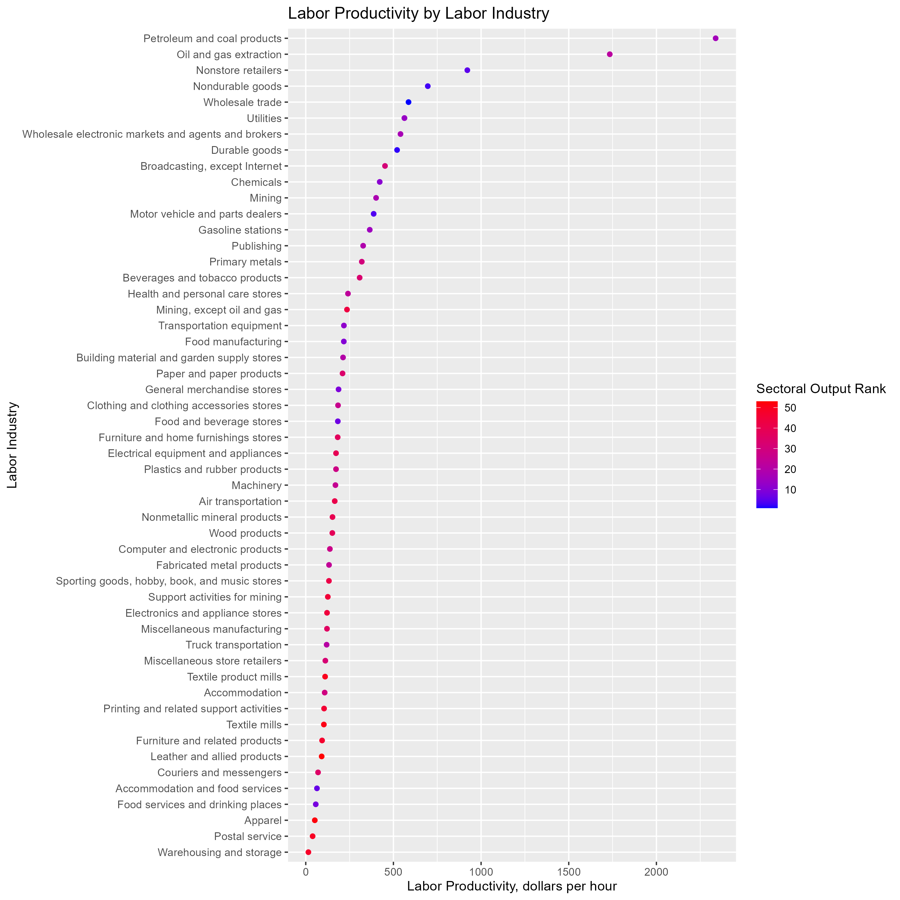
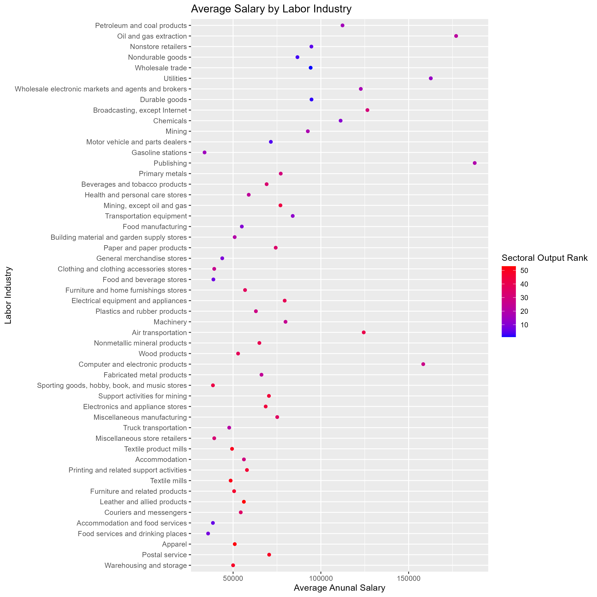
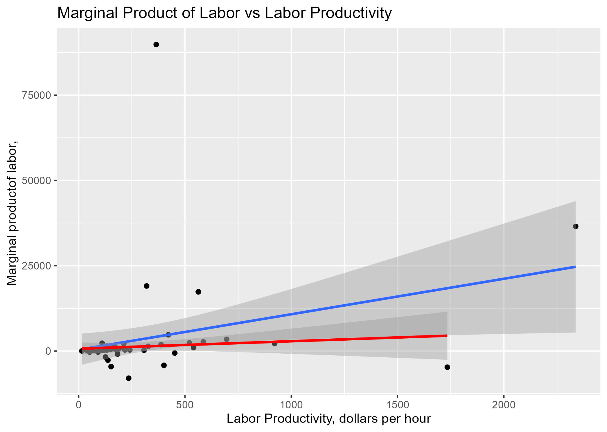
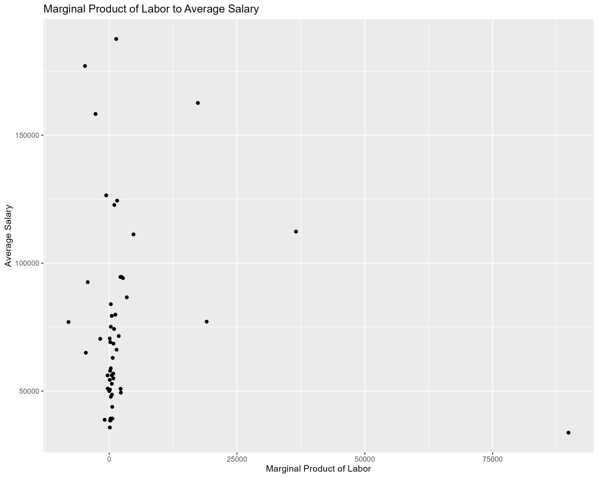

  This project examines the link between different industry’s labor productivity and worker compensation in the US for the year 2021. The labor market has been rapidly changing in recent years and understanding the direction it is moving is paramount to the health of the economy. Three key questions guided the analysis: 
1) How does productivity differ across US industries in 2021? 
2) Is there a link between productivity and worker compensation, and what does it look like?
3)  Which industries are outliers in terms of productivity and compensation?

  By exploring these questions, the study aims to illustrate the effects of the relationship between productivity and compensation. Such insights are invaluable not only in understanding the current labor market landscape but also in informing a range of economic decisions in the form of policy formulation, the establishment of equitable wage structures, and the strategic planning of businesses seeking to navigate the complexities of the modern economic environment. Ultimately, the findings of this research could serve as a guidepost for stakeholders in developing strategies that work to benefit from the current labor market conditions to create a system that benefits both the employer and their employees 

  We focused on just the year 2021 for 3 reasons. 2021 marked the return to normalcy from the peaks of the COVID-19 pandemic, which drastically shifted the structure of many industries. We expected this to mean that many longstanding assumptions about the labor market may no longer hold true. Second, expanding the analysis to examine trends across multiple years would exponentially increase the size of the project outside the scope. This paper serves as a first look into the modern labor economy and may prompt further investigation however, this would be more beneficial to do within a specific industry than economy wide. Finally, the data on industry employment was separated into different datasets with different information recorded, which would reduce the amount of data available to use within the analysis. The combination of these factors led us to choose to only examine data from 2021.

Dataset 1: Labor productivity and costs measures; Detailed industries (URL) (Labor Productivity dataset)
•	Source: US Bureau of Labor Statistics (From bls.gov)
•	Variables: Labor Productivity, Unit Labor Costs, Sectoral Output.
•	Coverage: United States, 1987 - 2022
•	Description: This dataset provides industry-level economic data, focusing on measures of productivity.
Dataset 2: Industry Employment and Wages - QCEW (URL) (Industry Dataset)
•	Source: Montana Data Portal (From Montana.Gov)
•	Variables: Industry, Ownership (government or private), Average number of Employees, Average Weekly Wage.
•	Coverage: United States, 2021
•	Description: This dataset contains information on worker compensation by industry

Dataset Relationship:

The initial dataset, the Labor Productivity Dataset, provides a comprehensive overview of the productivity landscape across various United States industries. This dataset is then intricately examined alongside the Industry Dataset, providing detailed insights into the compensation structures within these industries. The intersection of these datasets enables an evaluation of the relationship between industry productivity and worker compensation in the United States. However, it's crucial to note that the Industry Employment and Wages dataset solely encompasses data from the year 2021. To facilitate the merging process, inner joining based on NAICS code, and filtering the Labor Productivity dataset by year are required. A key challenge during the cleaning phase is combining industry attributes across datasets, given their differing labels in each source. Addressing this challenge involves grouping the industry attributes for effective alignment during the join operation.


```{r figure1_chunk, echo=FALSE, out.width='100%', fig.cap=""}

```

```{r figure2_chunk, echo=FALSE, out.width='100%', fig.cap=""}

```
  When examining the trajectory of labor productivity across various industries, it is crucial to consider the methodology applied. Within our analysis, productivity is gauged by the revenue generated per hour of labor input. The graphical representation reveals that most industries fall within the range of $250 to $750 of revenue per labor hour, with a few noticeable outliers.
The sectors with the highest labor productivity in 2021 are the Petroleum/Coal Products, Oil/Natural Gas Extraction, and Nonstore Retailers sectors. The placement of the energy sectors aligns logically with their intrinsic profitability, given how oil and gas sustain both the economy and our daily lives. Notably, 2021 marked a return to normalcy post-COVID, amplifying the demand for energy as travel surged, goods production escalated, and companies’ heavy technological integration along with the surge in cryptocurrencies. This contextual backdrop enhances the correlation between increased revenue and measured productivity, emphasizing a bias toward companies with fewer input hours and higher revenue.

  Another distinctive positive outlier is observed in Nonstore Retailers, encompassing online platforms such as Amazon and virtual products like video games, online education, and streaming services. The inherent lucrativeness of this sector stems from the fact that once a product/service is made, it can remain profitable with little maintenance required. Moreover, the shift made during and post-COVID towards online services highlighted the appeal and convenience of such applications, thus companies stuck with the adaptations made to technology during COVID.
  
  Conversely, the sectors exhibiting the lowest productivity are Postal Services and Warehousing/Storage. These industries experienced substantial revenue loss due to their susceptibility to the negative impacts of COVID. Compounded by an already streamlined workforce structure, where operations have already been optimized with minimal personnel, these sectors faced minimal layoffs relative to their revenue decline. This dual effect—reduced revenue and sustained working hours—accounts for their position as the least productive industries in 2021.


```{r figure3_chunk, echo=FALSE, out.width='100%', fig.cap=""}

```

The computation of the average salary involved dividing the total wages within each sector by the corresponding number of employees, resulting in an hourly wage. Assuming a standard 40-hour work week for 52 weeks per year, the average annual salary was calculated. Upon exploring the correlation between average salary and productivity, a notable positive trend emerged. This correlation persisted across both linear and geometric regressions. In the geometric regression, slight deviations were observed towards the end, attributed to the coal/petroleum industry exhibiting a lower average wage compared to the oil/gas industry. Consequently, industries with higher average salaries tended to display higher expected productivity.

  Among the major sectors in our dataset, the Oil/Gas Extraction, Publishing, and Utilities industries boasted the highest average salaries. This phenomenon is principally attributable to the specialized nature of work in these sectors, necessitating a workforce with specialized skill sets. The scarcity of qualified individuals to fill these roles, coupled with high demand, contributes to the high wages. In the Publishing sector, where the definition is confined to purely book publishers, the industry's high average salary is a result of its lean workforce composition. The higher proportion of managerial roles relative to the overall employee count contributes to lucrative earnings, despite the industry's relatively small number of workers.
  
  Conversely, the lowest average salaries were observed in the Gas Stations, Food/Beverages, and Clothing Accessory industries. This can be attributed to the broad accessibility of these roles, as they require widely available skills. Consequently, these industries are commonly associated with minimum wage jobs, given the perception that they can be performed by a broad spectrum of the workforce.


```{r figure4_chunk, echo=FALSE, out.width='100%', fig.cap=""}

```

  In our analysis, marginal product is defined as the incremental monetary output in dollars per additional worker. Initially, our interest in this statistic stemmed from the desire to explore potential relationships with other variables in our dataset. The hypothesis that higher marginal product values would correlate with higher overall productivity or average salary was not found in our data. Surprisingly, no discernible trend emerged when examining the relationship between marginal product and overall productivity or average salary. Additionally, a noteworthy observation was the prevalence of companies experiencing negative marginal returns. This phenomenon can be attributed to the significant layoffs in 2020 prompted by the COVID-19 pandemic. Moreover, numerous sectors transitioned to online platforms during this period, enhancing efficiency and profitability. The dual impact of workforce reductions and increased efficiency contributed to a higher number of diminishing marginal return values than anticipated.
  

```{r figure5_chunk, echo=FALSE, out.width='100%', fig.cap=" "}
 
```
---

The lack of a relationship between labor productivity and the marginal product of labor helps to explain the lack of an observable relationship between the marginal productivity of labor of an industry and its average salary. The distribution of the marginal product of labor indicates that in the current labor market, the employers hold the power. When the marginal product of labor is higher than the cost of higher than the cost of paying another employee, there is room for an employee to negotiate for additional pay and other compensation. Only four industries had a higher marginal product of labor than average salary, gas stations, Petroleum and coal products manufacturing, Primary Metal Manufacturing, and Utilities. The considerable number of companies with negative marginal product of labor was due almost entirely to companies laying off workers and increasing their profits. We attribute this to the behavioral shift in companies caused by the increased adoption of technological improvements during COVID.
	
	
Insights:

The insights derived from our analysis have some significant implications for real-world applications. Understanding the nuanced relationships between productivity and average salary provides valuable insights for industries seeking to optimize their operations. Notably, industries with high average salaries, such as Oil/Gas Extraction and Utilities, can leverage their specialized workforce by investing in skill development and innovation. Conversely, companies with lower average salaries might want to consider this correlation, as raising the salaries of their workers could lead to increased motivation, which could lead to higher productivity. Although this correlation does not imply that this causation is true, this is still an aspect that should be considered. 

Another insight that could be made is in obtaining these higher salaries. For instance, industries with high average salaries, such as Oil/Gas Extraction and Utilities, underscore the real-world value of cultivating a specialized skill set. Individuals pursuing careers in these sectors may find that investing in a distinct skill set enhances their earning potential, aligning with the observed higher wages. This insight can inform educational and training programs, guiding individuals toward areas of expertise in demand within the workforce.

Moreover, the examination of productivity trends across different industries offers investors and policymakers actionable intelligence. Industries exhibiting consistently high productivity levels, such as Petroleum/Coal Products and Nonstore Retailers, may signify sectors with promising returns on investment. Policymakers can use this information to tailor incentives and support to encourage growth in these high-productivity sectors, contributing to overall economic development. Simultaneously, businesses looking to diversify or invest in emerging markets may find our observations on productivity trends instrumental in identifying sectors with untapped potential, guiding strategic investment decisions. In this way, the real-world applications of our findings extend beyond theoretical insights, offering practical guidance for individuals, businesses, and policymakers navigating the complexities of the economic landscape.

